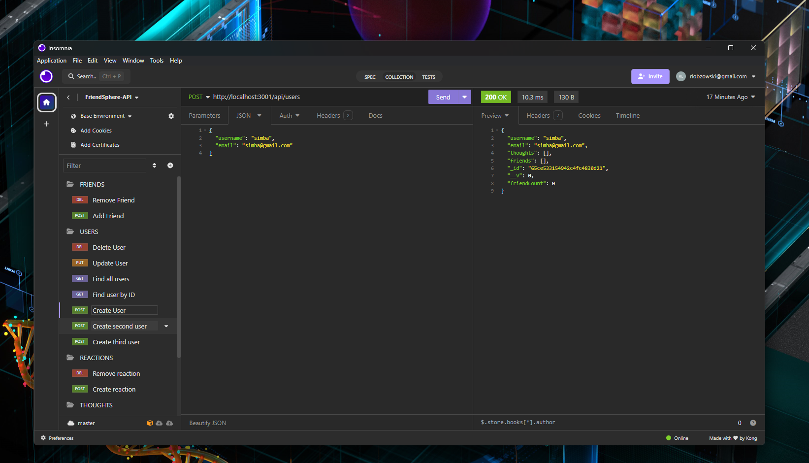
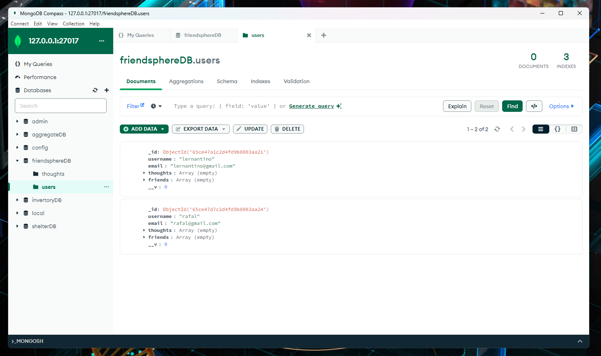

# FriendSphere-API

FriendSphere API is a social network web application API designed to handle large amounts of unstructured data using a NoSQL database. This API allows users to share their thoughts, react to friends' thoughts, and manage a friend list. Built with Express.js for routing, MongoDB as the database, and Mongoose as the ODM, it offers a robust backend for social networking platforms.





## Table of Contents

- [Demo Video](#demo-video)
- [Installation](#installation)
- [Usage](#usage)
- [API Routes](#api-routes)
- [Features](#features)
- [Technology](#technology)
- [Contributing](#contributing)
- [Credits](#credits)

## Demo Video

A walkthrough video demonstrating the functionality of the application can be found [here](https://drive.google.com/file/d/1XUpv2tbnz2GvS0jzIznDEDSKDQC-X_FG/view).

## Installation

To get started with FriendSphere API, follow these steps:

1. Ensure you have [Node.js](https://nodejs.org/en/) and [MongoDB](https://www.mongodb.com/try/download/community) installed on your machine.
2. Clone the repository to your local machine:

```bash
git clone git@github.com:rlobz/FriendSphere-API.git
```

3. Navigate to the project directory:

```bash
cd FriendSphere-API
```

4. Install the required npm packages:

```bash
npm install
```

## Usage

To run the FriendSphere API locally, follow these steps:

1. Start the MongoDB service on your machine.
2. Run the server using npm:

```bash
npm start
```

3. The server will start on `localhost:3001` (or your specified port). You can now use a tool like Insomnia or Postman to test the API routes.

## API Routes

### Users

- `GET /api/users`: Fetch all users.
- `GET /api/users/:id`: Fetch a single user by ID.
- `POST /api/users`: Create a new user.
- `PUT /api/users/:id`: Update a user by ID.
- `DELETE /api/users/:id`: Delete a user by ID.

### Thoughts

- `GET /api/thoughts`: Fetch all thoughts.
- `GET /api/thoughts/:id`: Fetch a single thought by ID.
- `POST /api/thoughts`: Create a new thought.
- `PUT /api/thoughts/:id`: Update a thought by ID.
- `DELETE /api/thoughts/:id`: Delete a thought by ID.

### Reactions

- `POST /api/thoughts/:thoughtId/reactions`: Add a reaction to a thought.
- `DELETE /api/thoughts/:thoughtId/reactions/:reactionId`: Remove a reaction from a thought.

### Friends

- `POST /api/users/:userId/friends/:friendId`: Add a friend.
- `DELETE /api/users/:userId/friends/:friendId`: Remove a friend.

## Features

- Share thoughts and reactions.
- Manage a friends list.
- API routes for users and thoughts, including CRUD operations.
- Reaction management within thoughts.
- Friend management for users.

## Technology

- **Node.js**: A JavaScript runtime built on Chrome's V8 JavaScript engine.
- **Express.js**: A fast, unopinionated, minimalist web framework for Node.js.
- **MongoDB**: A source-available cross-platform document-oriented database program.
- **Mongoose**: An elegant mongodb object modeling for Node.js.
- **Moment.js** (Optional): A JavaScript date library for parsing, validating, manipulating, and formatting dates.

## Contributing

Contributions to this project are welcome. Please ensure that your code adheres to the existing style and conventions.

## Credits

**Rafal Lobzowski**
- Github: [@rlobz](https://github.com/rlobz)